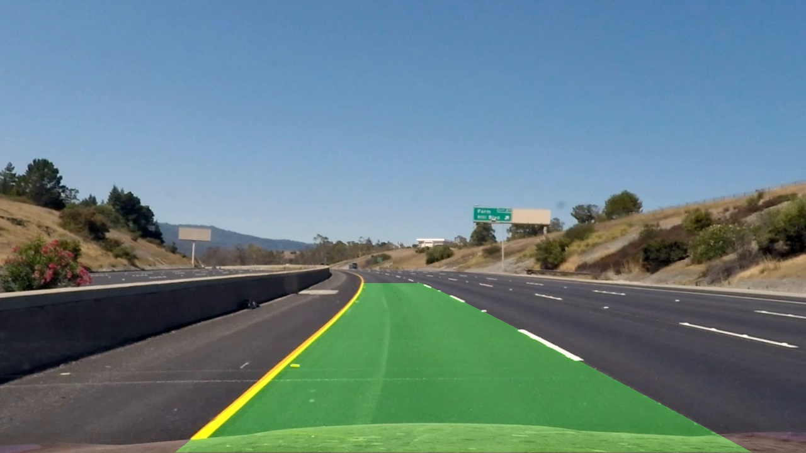

# Project: Advanced Lane Finding

Overview
---
The goal of this project is to write a software pipeline to identify the lane boundaries in a video. 

The pipeline uses standard computer vision techniques to correct distortion in the video, perform perspective transformations to get a bird's eye view of the lane. Then, Sobel edge detection is combined with color thresholding, to identify which pixels belong to the lane lines. A polynomial equation is fit to these lines and a polygon is drawn to cover the lane. Finally, the image is warped back to its original perspective. 

Check out [my writeup](writeup.md) to learn more about my process and how it works.

Dependencies
---
This lab requires:

* [CarND Term1 Starter Kit](https://github.com/udacity/CarND-Term1-Starter-Kit)

Input/Output
---
The images for camera calibration are stored in the folder called `camera_cal`.  The images in `test_images` are for testing the pipeline on single frames. The output from each stage of the pipeline is in the folder called `output_images`.

The `challenge_video.mp4` video is an extra (and optional) challenge for testing the pipeline under somewhat trickier conditions. The `harder_challenge.mp4` video is another optional challenge and is even harder.

The result of running the pipeline on `project_video.mp4` can be seen in `output_video.mp4`.
