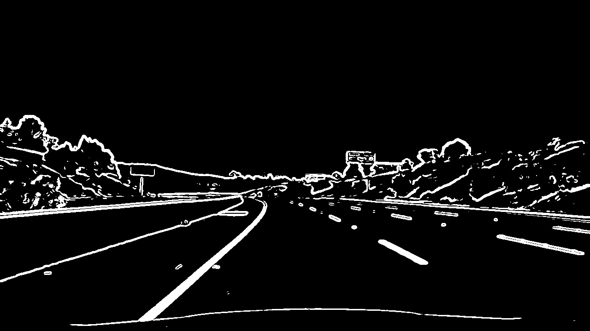
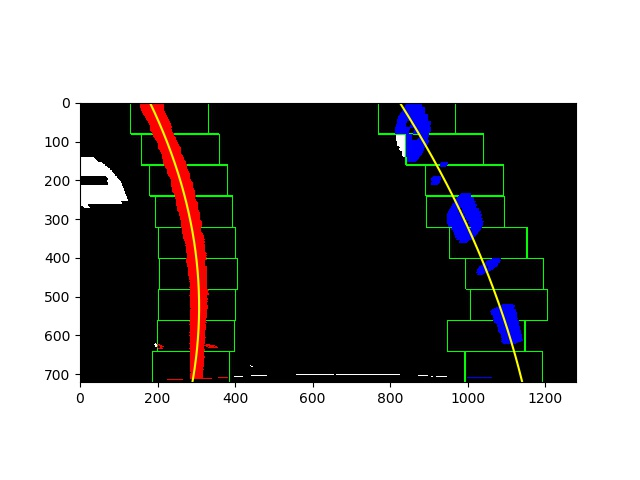

**Advanced Lane Finding Project**

The goals / steps of this project are the following:

* Compute the camera calibration matrix and distortion coefficients given a set of chessboard images.
* Apply a distortion correction to raw images.
* Use color transforms, gradients, etc., to create a thresholded binary image.
* Apply a perspective transform to rectify binary image ("birds-eye view").
* Detect lane pixels and fit to find the lane boundary.
* Determine the curvature of the lane and vehicle position with respect to center.
* Warp the detected lane boundaries back onto the original image.
* Output visual display of the lane boundaries and numerical estimation of lane curvature and vehicle position.

## [Rubric](https://review.udacity.com/#!/rubrics/571/view) Points

### Here I will consider the rubric points individually and describe how I addressed each point in my implementation.  

---

### Camera Calibration

#### 1. Briefly state how you computed the camera matrix and distortion coefficients. Provide an example of a distortion corrected calibration image.

The code for this step is located in the file called `camera.py`.  

I start by preparing "object points", which will be the (x, y, z) coordinates of the chessboard corners in the world. Here I am assuming the chessboard is fixed on the (x, y) plane at z=0, such that the object points are the same for each calibration image.  Thus, `objp` is just a replicated array of coordinates, and `objpoints` will be appended with a copy of it every time I successfully detect all chessboard corners in a test image.  `imgpoints` will be appended with the (x, y) pixel position of each of the corners in the image plane with each successful chessboard detection.  

I then used the output `objpoints` and `imgpoints` to compute the camera calibration and distortion coefficients using the `cv2.calibrateCamera()` function.  I applied this distortion correction to the test image using the `cv2.undistort()` function and obtained this result:


### Pipeline (single images)

#### 1. Provide an example of a distortion-corrected image.

To demonstrate this step, I will describe how I apply the distortion correction to one of the test images like this one:


#### 2. Describe how (and identify where in your code) you used color transforms, gradients or other methods to create a thresholded binary image.  Provide an example of a binary image result.

I used a combination of color and gradient thresholds to generate a binary image (thresholding steps at lines 54 through 57 in `detector.py`).  Here's an example of my output for this step.



#### 3. Describe how (and identify where in your code) you performed a perspective transform and provide an example of a transformed image.

The code for my perspective transform includes a function called `warp()`, which appears in lines 81 through 86 in the file `camera.py`, and a function called `calculateTransformMatrix()`, which takes care of calculating the transformation matrix during initialization. (output_images/examples/example.py) (or, for example, in the 3rd code cell of the IPython notebook).  The `warp()` function takes as inputs an image (`img`), while the `calculateTransformMatrix()` function takes an image shape (`shape`). I separated the initialization of the transformation matrix from the warping because it only needs to happen once and the matrix can be used for the rest of the program execution. By doing it this way it does not need to be calculated for every image which speeds things up a bit. I chose the hardcode the source and destination points in the following manner:

```python
bottom_left = [125, shape[0]]
top_left = [(shape[1]/2)-70, (shape[0]/2)+90]
top_right = [(shape[1]/2)+75, (shape[0]/2)+90]
bottom_right = [shape[1]-95, shape[0]]

src_corners = np.float32([bottom_left, top_left, top_right, bottom_right])
dst_corners = np.float32([
    [150, shape[0]],
    [150, 0],
    [shape[1]-150, 0],
    [shape[1]-150, shape[0]]
])
```

This resulted in the following source and destination points:

| Source        | Destination   |
|:-------------:|:-------------:|
| 125, 720      | 150, 720      |
| 570, 450      | 150, 0        |
| 715, 450      | 1130, 0       |
| 1185, 720     | 1130, 720     |

I verified that my perspective transform was working as expected by drawing the `src` and `dst` points onto a test image and its warped counterpart to verify that the lines appear parallel in the warped image.


#### 4. Describe how (and identify where in your code) you identified lane-line pixels and fit their positions with a polynomial?

Then I used the sliding window method to identify the lane lines in the image. To start, I produced a histogram of the bottom half of the image and used the positions of the two peaks on either side of the image as a base. Then, I found the nonzero pixels in the x and y directions within the window, and calculated the new position of the next window. This was done for each window all the way up the image, and then the indices of the nonzero points were used to fit a polynomial. Finally, I used the `Line` object to store the coefficients and averaged them over a moving window of 25 frames to smooth out the line.



#### 5. Describe how (and identify where in your code) you calculated the radius of curvature of the lane and the position of the vehicle with respect to center.

I did this in lines 49 through 57 in my code in `line.py` where I calculated the radius of each line independently using the equation given in the lessons. This is one of the areas that needs work, both because I'm not really sure my x and y scales are correct, and because the radius fluctuates rapidly and does not seem very accurate. Then, in lines 294 and 295 of `detector.py`, I averaged the radius of each line to get the overall radius.

#### 6. Provide an example image of your result plotted back down onto the road such that the lane area is identified clearly.

I implemented this step in lines # through # in my code in `detector.py` in the function `drawLane()`.  Here is an example of my result on a test image:


---

### Pipeline (video)

#### 1. Provide a link to your final video output.  Your pipeline should perform reasonably well on the entire project video (wobbly lines are ok but no catastrophic failures that would cause the car to drive off the road!).

Here's a [link to my video result](./output_video.mp4)

---

### Discussion

#### 1. Briefly discuss any problems / issues you faced in your implementation of this project.  Where will your pipeline likely fail?  What could you do to make it more robust?

The main problem I had on my original submission was that I was using `challenge_video.mp4` instead of `project_video.mp4`, and I was really having difficulty dealing with the shadows and the fact that the road was significantly lighter than in some of the test images. Once I realized that, my pipeline began performing much better, though I did still have a few issues with shadows and lighter road area.

To combat this, I tuned my thresholding some more and added thresholding in the LAB color space, which seemed to ignore shadows fairly well. I also added sanity checks on the width of the lane, both in a single frame and across multiple, and that definitely helped, but I would have suspected that would completely remove the jitteriness and it didn't quite get there. Overall though, it made the result much better.

One way the pipeline could be made more robust is to try to do feature extraction on the lane markings instead of simply using thresholding. For instance, a lane should have a higher value for all its pixels than the road on either side of it. In the case of a large shadow or bright area on the side of the road, the area of higher intensity pixels would most likely just have a single edge and not be a strip of high intensity.

In the case of a shadow covering the lines, this might help, but it might be better to detect that the overall brightness of the image has decreased and adjust the color/edge thresholding values on the fly.
